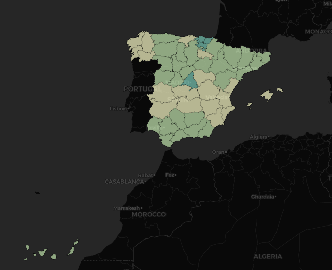

**Estudio de la evolución del SARS-CoV-2 en España desde el 01/01/2020 hasta el 09/03/2021 según datos científicos del Instituto Carlos III.**

* Síntomas más frecuentes e incapacitantes
* Sector de la población más afectada por sexo y grupo de edad
* Casos y pruebas realizadas (PCR, antígenos, anticuerpos, serológicas y otras)
* Hospitalizaciones, ingresos UCI y defunciones
* Incidencia acumulada a 14 y 7 días
