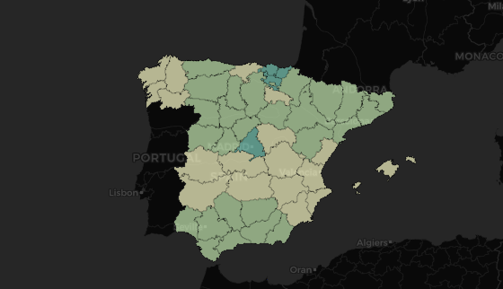

## Estudio de la evolución del SARS-CoV-2 en España desde el 01/01/2020 hasta el 09/03/2021 según datos científicos del Instituto Carlos III

Quería realizar un estudio 100% científico de la evolución del SARS-CoV-2 en España debido al antes y después que hemos experimentado y que estamos experimentando en todo el mundo en mayor o menor medida a causa del SARS-CoV-2. 

Los datasets que he usado para tal fin los he obtenido de la página web del [Instituto Carlos III](https://cnecovid.isciii.es/covid19/) y, al hacerlo, ví que no tenía datos de la población, por lo que tuve que recopilarlos de la página del [INE](https://www.ine.es/dyngs/INEbase/es/categoria.htm?c=Estadistica_P&cid=1254734710984).

Me he limitado a analizar la evolución de la pandemia y el grado de afectación al sector de la población por sexo, grupo de edad, sexo-grupo de edad en España desde el 01/01/2020 hasta el 09/03/2021. Quería analizar un poco más en profundidad y he bajado hasta el nivel de CCAA para poder determinar qué CCAA han sufrido más esta pandemia desde el inicio hasta el 09/03/2021 con indicadores propios de enfermedad (índice de letalidad e índice de mortalidad) y propios de esta pandemia (incidencia acumulada a 7 y 14 días).

### El proceso realizado ha sido el siguiente:

* Recopilación de información de las páginas web indicadas anteriormente
* Análisis de datos: La mayoría de los datos de los que disponía eran cuantitativos por lo que he realizado operaciones de `agrupación`, `conteo`, `sumatorio`. Todo el análisis y tratamiento de datos se puede ver en el notebook `COVID19`   
* Presentación de los resultados obtenidos en el formato PowerPoint en el archivo `Presentación COVID`

Todo el código está escrito en Python utilizando `notebooks`.

